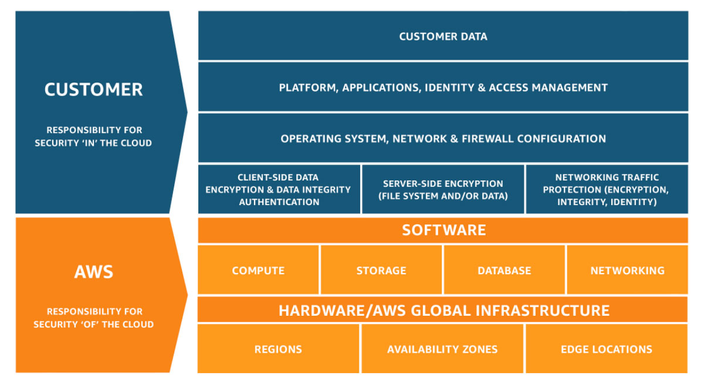

# Overview

- [Overview](#overview)
- [AWS Documentation](#aws-documentation)
- [Database](#database)
	- [Amazon Aurora](#amazon-aurora)
	- [DynamoDB](#dynamodb)
- [Billing & Cost Management](#billing--cost-management)
	- [AWS Cost and Usage Reports](#aws-cost-and-usage-reports)
	- [AWS Billing and Cost Management](#aws-billing-and-cost-management)
		- [Forecasting with Cost Explorer](#forecasting-with-cost-explorer)
		- [Cost Explorer](#cost-explorer)
	- [AWS Support Plans](#aws-support-plans)
	- [Amazon EC2 Pricing Plans](#amazon-ec2-pricing-plans)
		- [On-Demand](#on-demand)
		- [Spot instances](#spot-instances)
		- [Reserved instances](#reserved-instances)
		- [Dedicated Hosts](#dedicated-hosts)
- [Security, Identity, & Compliance](#security-identity--compliance)
	- [AWS Artifact](#aws-artifact)
	- [AWS Directory Service](#aws-directory-service)
	- [AWS Security Hub](#aws-security-hub)
	- [Amazon Inspector](#amazon-inspector)
	- [Amazon GuardDuty (S3 Duty)](#amazon-guardduty-s3-duty)
	- [Amazon Macie](#amazon-macie)
- [Machine Learning](#machine-learning)
	- [Amazon CodeGuru](#amazon-codeguru)
- [Management & Governance](#management--governance)
	- [AWS Service Catalog](#aws-service-catalog)
	- [AWS CloudFormation](#aws-cloudformation)
	- [AWS Control Tower](#aws-control-tower)
	- [AWS Organizations](#aws-organizations)
- [Developer Tools](#developer-tools)
	- [AWS CodePipeline](#aws-codepipeline)
	- [AWS CodeStar](#aws-codestar)
	- [AWS CodeBuild](#aws-codebuild)
	- [AWS Cloud9](#aws-cloud9)
- [Cyptography & PKI](#cyptography--pki)
	- [AWS CloudHSM](#aws-cloudhsm)
	- [AWS Certificate Manager (ACM)](#aws-certificate-manager-acm)
- [Other](#other)
	- [AWS Personal Health Dashboard](#aws-personal-health-dashboard)
	- [Shared Responsibility Model](#shared-responsibility-model)
- [Whizlabs Tricky questions](#whizlabs-tricky-questions)
- [Resources](#resources)
	- [AWS](#aws)
	- [Intellipaat](#intellipaat)
	- [Pluralsight](#pluralsight)
	- [Tutorials Dojo](#tutorials-dojo)
	- [Whizlabs](#whizlabs)
	- [Preparation](#preparation)

# AWS Documentation

- [All AWS Documentation](https://docs.aws.amazon.com/index.html?nc2=h_ql_doc_do_v)

# Database

## Amazon Aurora

High performance managed relational database | [Source](https://aws.amazon.com/rds/aurora/?nc2=type_a&aurora-whats-new.sort-by=item.additionalFields.postDateTime&aurora-whats-new.sort-order=desc)

A MySQL and PostgreSQL-compatible relational database built for the cloud, that combines the performance and availability of traditional enterprise databases with the simplicity and cost-effectiveness of open source databases.

Amazon Aurora is fully managed by [Amazon Relational Database Service (RDS)](https://aws.amazon.com/rds/), which automates time-consuming administration tasks like hardware provisioning, database setup, patching, and backups.

## DynamoDB

Fast and flexible NoSQL database service for any scale | [Source](https://aws.amazon.com/dynamodb/?nc2=type_a)

# Billing & Cost Management

## AWS Cost and Usage Reports

[Source](https://docs.aws.amazon.com/cur/latest/userguide/what-is-cur.html)

The AWS Cost and Usage Reports (AWS CUR) contains the most comprehensive set of cost and usage data available.

## AWS Billing and Cost Management

[Source](https://docs.aws.amazon.com/awsaccountbilling/latest/aboutv2/billing-what-is.html)

AWS Billing and Cost Management is the service that you use to pay your AWS bill, monitor your usage, and analyze and control your costs.

### Forecasting with Cost Explorer

[Source](https://docs.aws.amazon.com/awsaccountbilling/latest/aboutv2/ce-forecast.html)

You create a forecast by selecting a future time range for your report.

### Cost Explorer

[Source](https://docs.aws.amazon.com/awsaccountbilling/latest/aboutv2/ce-what-is.html)

[AWS Cost Explorer now Supports Usage-Based Forecasts](https://aws.amazon.com/about-aws/whats-new/2019/07/usage-based-forecasting-in-aws-cost-explorer/)

Cost Explorer is a tool that enables you to view and analyze your costs and usage.

## AWS Support Plans

[Source](https://aws.amazon.com/premiumsupport/plans/)

Plans

- Basic
- Developer
- Business
- Enterprise

Basic Support is included for all AWS customers and includes:

- Customer Service and Communities - 24x7 access to customer service, [documentation](https://docs.aws.amazon.com/), [whitepapers](https://aws.amazon.com/whitepapers/?whitepapers-main.sort-by=item.additionalFields.sortDate&whitepapers-main.sort-order=desc), and [support forums](https://forums.aws.amazon.com/index.jspa).
- [AWS Trusted Advisor](https://aws.amazon.com/premiumsupport/technology/trusted-advisor/) Access to the 7 core Trusted Advisor checks and guidance to provision your resources following best practices to increase performance and improve security.
- [AWS Personal Health Dashboard](https://aws.amazon.com/premiumsupport/technology/personal-health-dashboard/) - A personalized view of the health of AWS services, and alerts when your resources are impacted.

## Amazon EC2 Pricing Plans

[Source](https://aws.amazon.com/ec2/pricing/)

### On-Demand

With On-Demand instances, you pay for compute capacity by the hour or the second depending on which instances you run. No longer-term commitments or upfront payments are needed. You can increase or decrease your compute capacity depending on the demands of your application and only pay the specified per hourly rates for the instance you use.

### Spot instances

Amazon EC2 Spot instances allow you to request spare Amazon EC2 computing capacity for up to 90% off the On-Demand price.

### Reserved instances

Reserved Instances provide you with a significant discount (up to 75%) compared to On-Demand instance pricing. In addition, when Reserved Instances are assigned to a specific Availability Zone, they provide a capacity reservation, giving you additional confidence in your ability to launch instances when you need them.

### Dedicated Hosts

A Dedicated Host is a physical EC2 server dedicated for your use. Dedicated Hosts can help you reduce costs by allowing you to use your existing server-bound software licenses, including Windows Server, SQL Server, and SUSE Linux Enterprise Server (subject to your license terms), and can also help you meet compliance requirements.

# Security, Identity, & Compliance

## AWS Artifact

No cost, self-service portal for on-demand access to AWS’ compliance reports. | [Source](https://aws.amazon.com/artifact/?nc2=type_a)

AWS Artifact is your go-to, central resource for compliance-related information that matters to you.

## AWS Directory Service

Procides multiple ways to use Microsoft [Active Directory](https://en.wikipedia.org/wiki/Active_Directory) (AD) with other AWS services | [Source](https://docs.aws.amazon.com/directoryservice/latest/admin-guide/what_is.html)

## AWS Security Hub

Centrally view and manage security alerts and automate security checks | [Source](https://aws.amazon.com/security-hub/?aws-security-hub-blogs.sort-by=item.additionalFields.createdDate&aws-security-hub-blogs.sort-order=desc)

AWS Security Hub gives you a comprehensive view of your security alerts and security posture across your AWS accounts.

## Amazon Inspector

Analyze application security | [Source](https://aws.amazon.com/inspector/?nc2=type_a)

Tell inspector what targets to assess, and how often. Inspector can provide assesments at any stage in the deployment lifecycle.

Amazon Inspector is an automated security assessment service that helps improve the security and compliance of applications deployed on AWS. Amazon Inspector automatically assesses applications for exposure, vulnerabilities, and deviations from best practices.

## Amazon GuardDuty (S3 Duty)

Managed threat detection service | [Source](https://aws.amazon.com/guardduty/?nc2=type_a)

Amazon GuardDuty is a threat detection service that continuously monitors for malicious activity and unauthorized behavior to protect your AWS accounts, workloads, and data stored in Amazon S3.

## Amazon Macie

Discover, clasify, and protect your data | [Source](https://aws.amazon.com/macie/?nc2=type_a)

Macie, macie-ine language security service

Amazon Macie is a fully managed data security and data privacy service that uses machine learning and pattern matching to discover and protect your sensitive data in AWS.

# Machine Learning

## Amazon CodeGuru

Find your most expensive lines of code | [Source](https://aws.amazon.com/codeguru/)

Amazon CodeGuru is a developer tool powered by machine learning that provides intelligent recommendations for improving code quality and identifying an application’s most expensive lines of code.

# Management & Governance

## AWS Service Catalog

Enables organizations to create and manage catalogs of IT services that are approved for use on AWS. | [Source](https://docs.aws.amazon.com/servicecatalog/latest/adminguide/introduction.html)

AWS Service Catalog allows organizations to centrally manage commonly deployed IT services, and helps organizations achieve consistent governance and meet compliance requirements.

Amazon DynamoDB is a key-value and document database that delivers single-digit millisecond performance at any scale.

## AWS CloudFormation

Create and manage AWS resources stacks with templates | [Source](https://aws.amazon.com/cloudformation/?nc2=type_a)

Manage your "Infrastructure Architecture". CloudFormation can provision and configure your AWS resource stack. Configureable with a JSON "template" or you can choose from prebuilt templates.

AWS CloudFormation gives you an easy way to model a collection of related AWS and third-party resources, provision them quickly and consistently, and manage them throughout their lifecycles, by treating infrastructure as code.

## AWS Control Tower

Set up and govern a secure, compliant multi-account environment | [Source](https://aws.amazon.com/controltower/)

If you’re an organization with multiple AWS accounts and teams, cloud setup and governance can be complex and time consuming, slowing down the very innovation you’re trying to speed up. AWS Control Tower provides the easiest way to set up and govern a new, secure, multi-account AWS environment based on best practices established through AWS’ experience working with thousands of enterprises as they move to the cloud.

## AWS Organizations

Policy-based management for multiple AWS accounts. | [Source](https://aws.amazon.com/organizations/?nc2=type_a)

AWS Organizations helps you centrally govern your environment as you grow and scale your workloads on AWS.

# Developer Tools

## AWS CodePipeline

Release software using continuous delivery | [Source](https://aws.amazon.com/codepipeline/?nc2=type_a)

A fully managed continuous delivery service that helps you automate your release pipelines for fast and reliable application and infrastructure updates.

## AWS CodeStar

Quickly develop, build, and deploy applications on AWS | [Source](https://aws.amazon.com/codestar/?c=10&pt=8)

AWS CodeStar enables you to quickly develop, build, and deploy applications on AWS. AWS CodeStar provides a unified user interface, enabling you to easily manage your software development activities in one place.

## AWS CodeBuild

Build and test code | [Source](https://aws.amazon.com/codebuild/?nc2=type_a)

Build and test code with continuous scaling. Pay only for the build time you use.

AWS CodeBuild is a fully managed continuous integration service that compiles source code, runs tests, and produces software packages that are ready to deploy.

## AWS Cloud9

Write, run, and debug code on a cloud IDE | [Source](https://aws.amazon.com/codebuild/?nc2=type_a)

A cloud IDE for writing, running, and debugging code

# Cyptography & PKI

## AWS CloudHSM

Managed hardware security module (HSM) on the AWS Cloud. | [Source](https://aws.amazon.com/cloudhsm/?nc2=type_a)

AWS CloudHSM is a cloud-based hardware security module (HSM) that enables you to easily generate and use your own encryption keys on the AWS Cloud.

## AWS Certificate Manager (ACM)

Provision, manage, and depoy SSL/TLS certificates | [Source](https://aws.amazon.com/certificate-manager/?nc2=type_a)

AWS Certificate Manager is a service that lets you easily provision, manage, and deploy public and private Secure Sockets Layer/Transport Layer Security (SSL/TLS) certificates for use with AWS services and your internal connected resources.

# Other

## AWS Personal Health Dashboard

Personalized view of AWS service health | [Source](https://aws.amazon.com/premiumsupport/technology/personal-health-dashboard/)

AWS Personal Health Dashboard provides alerts and remediation guidance when AWS is experiencing events that may impact you. Personal Health Dashboard gives you a personalized view into the performance and availability of the AWS services underlying your AWS resources.

## Shared Responsibility Model

Security and Compliance is a shared responsibility between AWS and the customer | [Source](https://aws.amazon.com/compliance/shared-responsibility-model/)

# Whizlabs Tricky questions

Here are some notes from their [free practice exam](https://www.whizlabs.com/learn/course/aws-certified-cloud-practitioner-practice-tests/).

- There is no "AWS Resource center" - [Getting Started Resource Center](https://aws.amazon.com/getting-started/)
- There is no "Premium" AWS Support Plan
- "AWS Service health dashboard" - [https://status.aws.amazon.com/](https://status.aws.amazon.com/)
  - "AWS Publishes most up-to-the-minute information on AWS service availability here."

# Resources

## AWS

- [https://aws.amazon.com/certification/certified-cloud-practitioner/](https://aws.amazon.com/certification/certified-cloud-practitioner/)
- [https://d0.awsstatic.com/whitepapers/aws-overview.pdf](https://d0.awsstatic.com/whitepapers/aws-overview.pdf)
- [https://d1.awsstatic.com/whitepapers/AWS_Cloud_Best_Practices.pdf](https://d1.awsstatic.com/whitepapers/AWS_Cloud_Best_Practices.pdf)
- [https://d0.awsstatic.com/whitepapers/aws_pricing_overview.pdf](https://d0.awsstatic.com/whitepapers/aws_pricing_overview.pdf)
- [https://media.amazonwebservices.com/AWS_TCO_Web_Applications.pdf](https://media.amazonwebservices.com/AWS_TCO_Web_Applications.pdf)
- [https://aws.amazon.com/premiumsupport/plans/](https://aws.amazon.com/premiumsupport/plans/)

## Intellipaat

- [https://intellipaat.com/mediaFiles/2019/02/AWS-Basic-Cheat-Sheet.png](https://intellipaat.com/mediaFiles/2019/02/AWS-Basic-Cheat-Sheet.png)

## Pluralsight

- [https://app.pluralsight.com/library/courses/fundamental-cloud-concepts-aws/table-of-contents](https://app.pluralsight.com/library/courses/fundamental-cloud-concepts-aws/table-of-contents)

## Tutorials Dojo

- [https://tutorialsdojo.com/](https://tutorialsdojo.com/)

## Whizlabs

- [Free Practice Test for AWS Certified Cloud Practitioner](https://www.whizlabs.com/learn/course/aws-certified-cloud-practitioner-practice-tests/)

## Preparation

- [Prepare for Your AWS Certification Exam](https://aws.amazon.com/certification/certification-prep/)
- [Sample Questions](https://d1.awsstatic.com/training-and-certification/docs-cloud-practitioner/AWS-Certified-Cloud-Practitioner_Sample-Questions.pdf)
- [Exam Guide](https://d1.awsstatic.com/training-and-certification/docs-cloud-practitioner/AWS-Certified-Cloud-Practitioner_Exam-Guide.pdf)
- [John Fay's notes](https://github.com/keonik/AWS-cloud-practitioner-notes)
